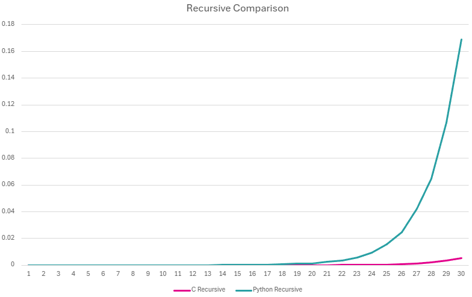
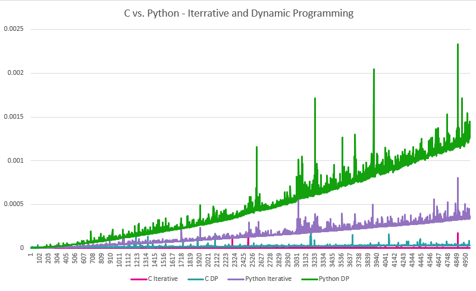

[](https://classroom.github.com/a/kdfTwECC)
# Midterm p1: Report on Analysis of Fibonacci  Series
* **Author**: Emily Despres
* **GitHub Repo**: [https://github.com/CS5008Fall2025/midterm-report-zembug/tree/main](https://github.com/CS5008Fall2025/midterm-report-zembug/tree/main)
* **Semester**: Fall 2025
* **Languages Used**: c, python

> You are free to rename/ modify these sections as you need (and don't forget to remove this line..)

## Overview

This report explores the Fibonacci sequence, a foundational concept in mathematics and computer science known for its recursive structure and widespread applications. The sequence begins with 0 and 1, and each subsequent number is the sum of the two preceding ones. Mathematically, it is defined as:

$$F(n) = F(n - 1) + F(n - 2)$$

with base cases:

$$F(0) = 0 \quad \text{and} \quad F(1) = 1$$

The sequence progresses as:

 $$0,\ 1,\ 1,\ 2,\ 3,\ 5,\ 8,\ 13,\ 21,\ 34,\ 55,\ 89,\ 144,\ 233,\ 377,\ 610,\ 987,\ 1597,\ 2584,\ 4181\ldots$$

 
First introduced to Western mathematics by Leonardo of Pisa (Fibonacci) in his 1202 book Liber Abaci, the sequence was originally used to model rabbit population growth under ideal conditions. [1][2]

Many patterns in nature reflect the Fibonacci sequence not just in appearance, but in function. For example, the number of petals on certain flowers often corresponds to Fibonacci numbers. Lilies typically have 3 petals, buttercups have 5, and some varieties of daisies can have 34. [1] These numbers are not arbitrary. They result from a process called phyllotaxis, which governs how plants grow and arrange their leaves, petals, or seeds. Fibonacci based arrangements ensure that each leaf or petal receives maximum sunlight and minimizes overlap with others. [3] Similarly, the spiral patterns found in sunflowers, pinecones, and pineapples often match consecutive Fibonacci numbers, helping distribute seeds evenly and efficiently [4].

The sequence’s relevance extends into algorithm design, dynamic programming, and number theory. It serves as a benchmark for evaluating recursive depth, computational efficiency, and memory usage across different programming paradigms. In this report, I analyze and compare three common approaches to computing Fibonacci numbers: recursive, iterative, and dynamic programming, using both C and Python. Each method offers different strengths and challenges in terms of time complexity, space usage, and implementation style. The goal is to understand how algorithmic design and language features influence performance.

To begin my analysis of the three approaches, I first examine their Big O notation to understand the time and space complexity involved in executing each algorithm.

| Version |  Big O | Space Used | 
| :-- | :-- |  :-- |
| Recursive | $O(2^n)$  | $O(n)$ |
| Iterative | $O(n)$ | $O(1)$ |
| Dynamic Programming | $O(n)$ | $O(n)$ |


**Recursive Approach**

With the recursive approach, the Big O notation is $O(2^n)$, representing exponential time. We can represent the time complexity as:

$$T(n) = T(n-1) + T(n-2) + O(1)$$

Each call to $F(n)$, the nth Fibonacci number, generates two additional calls: $F(n-1)$ and $F(n-2)$. This branching continues until the base cases are reached, creating a binary recursion tree. Each level of the tree roughly doubles the number of calls, and the tree’s height is $n$. The total number of nodes in such a tree is proportional to $2^n$, which leads to the exponential time complexity. [8]

For space, the algorithm uses $O(n)$ because each recursive call adds a new layer to the call stack. The maximum depth of recursion equals $n$, so memory usage grows linearly with the input size. [5]

```text
// Recursive pseudocode

function Fibonacci(n)
    // base cases
    if n is 0 or 1
        return n

    else
        //sum of previous two numbers
        return Fibonacci(n-1) + Fibonacci(n-2) 
```


**Iterative Approach**

With the iterative approach, the Big O notation is $O(n)$, representing linear time. We can represent the time complexity as:

$$T(n) = T(n-1) + O(1)$$

This is because the loop runs once for each value from 2 up to $n$, performing a constant-time operation at each step. Expanding the recurrence shows there are $n-1$ constant-time iterations, giving a total $O(n)$ work. The algorithm starts with the base cases and computes each Fibonacci number in sequence, avoiding any redundant calculations. 

For space, the algorithm uses a constant $O(1)$, since it only requires a fixed number of variables to track the current and previous values. As a result, memory usage remains constant regardless of the input size. [6]

```text
// Iterative pseudocode

function Fibonacci(n)
    // base cases
    if n is 0 or 1
        return n

    set prev = 0 // first Fibonacci number
    set curr = 1 // second Fibonacci number

    for i from 2 to n // loop from index 2 to n
        set next = prev + curr // compute next Fibonacci number
        set prev = curr // update previous number
        set curr = next // update current number
    return curr // return nth Fibonacci number
```

**Dynamic Programming Approach**

With the dynamic programming approach, the Big O notation is $O(n)$, representing linear time. This is because each Fibonacci number from $F(2)$ up to $F(n)$ is computed exactly once, using previously stored values to perform constant-time additions at each step. We can represent the time complexity as:

$$T(n) = T(n-1) + O(1)$$

Each iteration from $2$ to $n$ does constant work, so the total work grows linearly with $n$ (O(n)). The algorithm begins with the base cases and builds the sequence incrementally, storing each result in a data structure for reuse. 

For space, the algorithm uses $O(n)$, since it maintains an array or list of size $(n+1)$ to hold all computed values from $F(0)$ through $F(n)$. As a result, both time and memory usage grow linearly with the input size. [7][9]

```text
// Dynamic programming pseudocode

function Fibonacci(n)
    // base cases
    if n is 0 or 1
        return n
    
    create array arr of size (n + 1) // list to store Fibonacci numbers from index 0 to n
    set arr[0] to 0 // first Fibonacci number is 0
    set arr[1] to 1 // second Fibonacci number is 1

    for i from 2 to n // loop from index 2 to n
        set arr[i] = arr[i - 1] + arr[i - 2] // sum of previous two numbers
    return arr[n] //return nth Fibonacci number
```

## Empirical Data & Discussion

For all empirical results, each run was limited to a maximum of 60 seconds. This threshold ensured that the data collection process remained responsive and could evaluate a wide range of input sizes without excessive delays.

The follwing is a summary of how each Fibonacci implementation performed. In terms of runtime and the number of operations executed.


### Operations Comparison

The number of operations for each Fibonacci algorithm was measured by incrementing a counter at the recursive or loop entry point. This ensured consistency across both C and Python implementations, allowing for meaningful comparisons between iterative, dynamic programming, and naive recursive approaches. 

In both C and Python, the dynamic programming version used a bottom-up tabulation strategy, storing intermediate results in an array. This approach avoids redundant computation and produced identical operation counts across languages, confirming that the counter was placed correctly and measured the intended behavior. 

The chart below shows the first 30 Fibonacci indices for Python and the first 40 for C. Beyond index 30, the recursive version in Python began to exceed the time limit. In C, the recursive version was able to reach index 40, though further inputs became impractical within the 60-second constraint. For full operation counts. For full operation counts, see [ops_c_run.csv](ops_c_run.csv) and [ops_python_run.csv](ops_python_run.csv).

#### C Operations Count
| **N** | **Iterative** | **Dynamic Programming** | **Recursive** |
|-------|---------------:|-------------------------:|---------------:|
| 1     | 0             | 0                       | 1             |
| 2     | 1             | 1                       | 3             |
| 3     | 2             | 2                       | 5             |
| 4     | 3             | 3                       | 9             |
| 5     | 4             | 4                       | 15            |
| 6     | 5             | 5                       | 25            |
| 7     | 6             | 6                       | 41            |
| 8     | 7             | 7                       | 67            |
| 9     | 8             | 8                       | 109           |
| 10    | 9             | 9                       | 177           |
| 11    | 10            | 10                      | 287           |
| 12    | 11            | 11                      | 465           |
| 13    | 12            | 12                      | 753           |
| 14    | 13            | 13                      | 1,219         |
| 15    | 14            | 14                      | 1,973         |
| 16    | 15            | 15                      | 3,193         |
| 17    | 16            | 16                      | 5,167         |
| 18    | 17            | 17                      | 8,361         |
| 19    | 18            | 18                      | 13,529        |
| 20    | 19            | 19                      | 21,891        |
| 21    | 20            | 20                      | 35,421        |
| 22    | 21            | 21                      | 57,313        |
| 23    | 22            | 22                      | 92,735        |
| 24    | 23            | 23                      | 150,049       |
| 25    | 24            | 24                      | 242,785       |
| 26    | 25            | 25                      | 392,835       |
| 27    | 26            | 26                      | 635,621       |
| 28    | 27            | 27                      | 1,028,457     |
| 29    | 28            | 28                      | 1,664,079     |
| 30    | 29            | 29                      | 2,692,537     |
| 31    | 30            | 30                      | 4,356,617     |
| 32    | 31            | 31                      | 7,049,155     |
| 33    | 32            | 32                      | 11,405,773    |
| 34    | 33            | 33                      | 18,454,929    |
| 35    | 34            | 34                      | 29,860,703    |
| 36    | 35            | 35                      | 48,315,633    |
| 37    | 36            | 36                      | 78,176,337    |
| 38    | 37            | 37                      | 126,491,971   |
| 39    | 38            | 38                      | 204,668,309   |
| 40    | 39            | 39                      | 331,160,281   |


#### Python Operations Count 
| **N** | **Iterative** | **Dynamic Programming** | **Recursive** |
|-------|---------------:|-------------------------:|---------------:|
| 1     | 0             | 0                       | 1             |
| 2     | 1             | 1                       | 3             |
| 3     | 2             | 2                       | 5             |
| 4     | 3             | 3                       | 9             |
| 5     | 4             | 4                       | 15            |
| 6     | 5             | 5                       | 25            |
| 7     | 6             | 6                       | 41            |
| 8     | 7             | 7                       | 67            |
| 9     | 8             | 8                       | 109           |
| 10    | 9             | 9                       | 177           |
| 11    | 10            | 10                      | 287           |
| 12    | 11            | 11                      | 465           |
| 13    | 12            | 12                      | 753           |
| 14    | 13            | 13                      | 1,219         |
| 15    | 14            | 14                      | 1,973         |
| 16    | 15            | 15                      | 3,193         |
| 17    | 16            | 16                      | 5,167         |
| 18    | 17            | 17                      | 8,361         |
| 19    | 18            | 18                      | 13,529        |
| 20    | 19            | 19                      | 21,891        |
| 21    | 20            | 20                      | 35,421        |
| 22    | 21            | 21                      | 57,313        |
| 23    | 22            | 22                      | 92,735        |
| 24    | 23            | 23                      | 150,049       |
| 25    | 24            | 24                      | 242,785       |
| 26    | 25            | 25                      | 392,835       |
| 27    | 26            | 26                      | 635,621       |
| 28    | 27            | 27                      | 1,028,457     |
| 29    | 28            | 28                      | 1,664,079     |
| 30    | 29            | 29                      | 2,692,537     |


### Recursive Versions

 

The runtime growth of the recursive Fibonacci implementation is clearly exponential in both C and Python. While both versions begin with negligible runtimes for small inputs, the difference in scalability becomes increasingly apparent as $N$ increases.

Python’s recursive version begins to diverge significantly around $N=14$, crossing 0.1 seconds by $N=20$ and reaching over 0.16 seconds by $N=30$. In contrast, the C version remains under 0.01 seconds until roughly $N=20$, and only begins to show noticeable growth beyond that point. By $N=30$, the C version reaches approximately 0.005 seconds. Still far below Python’s runtime for the same input.

This disparity reflects the overhead of Python’s interpreted execution and function call stack management, compared to C’s compiled efficiency. Although both implementations are structurally identical and lack memoization, C’s lower-level execution allows it to handle deeper recursion more gracefully.

The chart visualizes this divergence, with Python’s curve rising sharply after $N=20$, while C’s curve remains relatively flat until the final few indices. Beyond $N=30$, Python was skipped due to performance constraints, while C continued up to $N=40$ in separate trials.

### Iterative and Dynamic Programming Versions

 

Thanks to the high speed of both the iterative and dynamic programming versions, we were able to test much larger values of $N$, which revealed more gradual and readable runtime curves. In the chart, Python’s dynamic programming version shows the steepest curve, rising more noticeably as $N$ increases. Python’s iterative version also curves upward, but not as sharply. It follows a similar shape with slightly better performance.

Meanwhile, both C versions, iterative and dynamic programming, stay very close to the bottom of the chart. Their runtimes increase only slightly, forming a gentle incline that’s almost flat compared to Python. This shows how efficient C is for these types of algorithms, especially when compared to Python’s interpreted execution. The overall shapes of the curves are similar across all four methods, but the height and steepness vary due to language differences and minor overheads.

Both the iterative and dynamic programming approaches run in $O(n)$ so the runtime grows in proportion to the input size. This matches what we see in the chart. A steady, predictable increase without sudden jumps. The loop in each version runs once per Fibonacci number, and there are no nested calls or repeated calculations, just one addition per step. This makes them ideal for computing large values of $N$ efficiently.


## Language Analysis

The code writing can be found in the following files:
* [fibonacci.c](fibonacci.c)  -- implementation of functions in c
* [fibonacci.py](fibonacci.py) -- implementation of function in python
* [test_runner.py](test_runner.py) -- run script to help with tests and keep timings

I began developing the code in C, using class examples as a foundation. Specifically, I drew from the dynamic programming lab and the sample midterm to help structure the test runner file and validate outputs. Once the core implementations were working in C, I mirrored the logic in Python to maintain consistency across versions.

I chose Python as the second language because it was the first one I learned and I’ve always found it easy to read and enjoyable to use. Working with it again gave me a chance to better understand how recursion works and how to keep track of values during function calls. Python’s simple syntax and built-in tools made it easier to write clean code and avoid common mistakes, especially when comparing different ways to solve the same problem.

### Language 1: C

Initially, I used int for return types and loop counters, but this quickly became problematic for larger values of $N$. The Fibonacci sequence grows rapidly, and I started seeing incorrect results and even negative operation counts due to integer overflow. To fix this, I switched to `unsigned long long (ull)` for all return types and accumulators, which allowed the program to handle much larger values safely.

The recursive version was the most straightforward to implement and closely followed the mathematical definition. I added an operation counter to track the number of function calls, which helped quantify how quickly the workload increased. For large $N$, the recursive version became impractical due to exponential growth in calls and stack depth, so I limited its use to $N≤40$.

The iterative version was the most efficient and easiest to control. It used constant space and a simple loop to build up the Fibonacci sequence, with each addition counted as a single operation:

```
ull fib_iterative(int n, ull* ops) {
    *ops = 0;
    if (n == 0) return 0;
    if (n == 1) return 1;

    ull prev = 0, curr = 1, next;
    for (int i = 2; i <= n; i++) {
        next = prev + curr;
        prev = curr;
        curr = next;
        (*ops)++;
    }
    return curr;
}
```

For dynamic programming, I implemented a bottom-up approach using a heap-allocated array. This avoided stack overflow and allowed intermediate results to be stored iteratively. Each addition was counted as an operation, and the array was freed after use to prevent memory leaks:

```
ull fib_dynamic(int n, ull* ops) {
    *ops = 0;
    if (n == 0) return 0;
    if (n == 1) return 1;

    ull* arr = (ull*)malloc((n + 1) * sizeof(ull));
    arr[0] = 0;
    arr[1] = 1;

    for (int i = 2; i <= n; i++) {
        arr[i] = arr[i - 1] + arr[i - 2];
        (*ops)++;
    }

    ull result = arr[n];
    free(arr);
    return result;
}
```

I also wrote custom timing and output functions using clock() and PRIu64 formatting to measure runtime and display results. These utilities were essential for comparing how each version performed across different values of $N$. Overall, the C implementations required more manual setup and debugging, but they offered precise control over memory, execution flow, and performance tracking.


### Language 2: Python

While writing the Python versions of the Fibonacci functions, I made several choices to keep the code safe, consistent, and easy to understand. First, I added operation counters to all three methods so I could see how many steps each one takes. This helped me compare how efficient each version was. Not just by how fast they ran, but by how much work they actually did.

For the iterative and dynamic programming versions, I had each function return two things: the final Fibonacci number and the number of operations. I did this using a tuple like return `curr`, `ops`, which keeps everything self-contained and avoids using global variables. If I had only returned the result, I wouldn’t be able to track how many steps were performed.

```
return curr, ops
```

The recursive version needed a different approach. Since Python doesn’t let you change numbers directly inside recursive calls, I used a list like `ops_counter = [0]` to keep track of operations. Lists are mutable, so I could update the counter inside each call. If I had used a regular integer like `ops = 0`, it would reset every time and give the wrong count.

```
def fib_recursive(n, ops_counter):
    ops_counter[0] += 1
```

Finally, I made sure all three functions followed the same pattern: they take $n$ as input, return both the result and the operation count, and work smoothly with my `run_and_time() function`. This consistency made it easier to test and compare them. If one function had a different setup, it would have caused problems in the runner and made the results harder to manage.


### Comparison and Discussion Between Experiences

Working with both C and Python helped me see how different languages affect the way you write and test code. Even though the logic behind each Fibonacci function was the same, the process of getting everything to work—and making sure the results were accurate—felt very different.

In C, I started by using `int` for return values and counters, but that quickly caused problems. The Fibonacci numbers grow fast, and once they got too big, the values started wrapping around and turning negative. This was especially bad for the operation counter in the recursive version. To fix it, I switched to `unsigned long long`, which can hold much larger numbers. I also added a typedef at the top of the file to make the code cleaner. Python didn’t have this issue, its integers can grow as big as needed, so I didn’t have to worry about overflow there.

The recursive version was easy to write in both languages, but it became very slow for large inputs. In C, the operation count got so high it started overflowing, and the function took too long to finish. I limited it to 
$𝑁≤40$ to avoid crashes and bad data. In Python, I ran into a different issue: I couldn’t just pass an integer to track operations, because it would reset every time the function was called. Instead, I used a list like `ops = [0]`, which let me update the counter inside each call. This worked well and gave me accurate counts.

One interesting thing I noticed was that the number of operations in the recursive version was often much higher than the Fibonacci number itself. That helped show how inefficient plain recursion can be.

Getting all three results (recursive, iterative, dynamic) to print correctly to a CSV file was tricky in C. At first, only the iterative column showed up. I found that the recursive version was either timing out or giving bad results for large $N$, which messed up the formatting. In Python, I had a GitHub rendering issue where the CSV didn’t show anything for recursive timeouts, making the table look incomplete. I fixed this by adding a placeholder value when the recursive result wasn’t available.

After finishing the main versions, I thought about adding memoization to the recursive function to make it faster. In Python, this would have been easy with a dictionary or a decorator. But I decided not to include memoization because it would blur the line between recursion and dynamic programming. My goal was to compare three distinct strategies: plain recursion, iteration, and bottom-up dynamic programming, to show how each one behaves on its own. Memoization is a way of speeding up recursion by storing results, which makes it act more like dynamic programming. If I had added it, the recursive version wouldn’t be truly recursive anymore, and the performance differences between the methods would be harder to see. I wanted to keep the comparison clean and highlight how much more efficient the iterative and dynamic versions are without any extra help.

## Conclusions / Reflection

## References

1. GeekforGeeks. 2025. Real Life Applications of Fibonacci Sequence. (July 23, 2025). Retrieved October 12, 2025 from   https://www.geeksforgeeks.org/maths/real-life-applications-of-fibonacci-sequence/

2. The Department of Mathematics and Computer Science. n.d. Fibonacci's Rabbits. Retrieved October 12, 2025 from https://mathcenter.oxford.emory.edu/site/math125/fibonacciRabbits/

3. Biolecta. 2024. The Fibonacci Sequence: Its Importance in Math and Nature. (December 5, 2024) Retrieved October 12, 2025 from https://biolecta.com/articles/fibonacci-sequence-importance-mathematics-nature/

4. Insteading. 2023. The Fibonacci Sequence in Nature. (September 6, 2023). Retrieved October 12, 2025 from
https://insteading.com/blog/fibonacci-sequence-in-nature/

5. Real Python. 2023. A Python Guide to the Fibonacci Sequence. (December 1, 2023) Retrieved October 14, 2025. https://realpython.com/fibonacci-sequence-python/

6. matrixRead. 2020. Fibonacci Series - Iterative vs Recursive. (October 16, 2020). Retrieved October 14, 2025 from https://matrixread.com/fibonacci-series-iterative-vs-recursive/

7. GeeksforGeeks. 2025. Dynamic Programming (DP) Introduction. (August 7, 2025). Retrieved October 14, 2025 from https://www.geeksforgeeks.org/dsa/introduction-to-dynamic-programming-data-structures-and-algorithm-tutorials/

8. GeeksforGeeks. 2025. Time complexity of recursive Fibonacci program. (August 27, 2025). Retrieved October 14, 2025 from https://www.geeksforgeeks.org/dsa/time-complexity-recursive-fibonacci-program/?utm_source=chatgpt.com

9. Baeldung. 2024. Computational Complexity of Fibonacci Sequence. (March 18, 2024). Retrieved October 14, 2025 from https://www.baeldung.com/cs/fibonacci-computational-complexity
